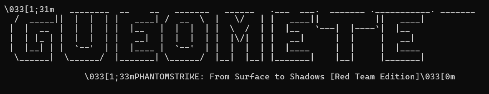

# 🕵️ PhantomStrike — Red Team Recon & Attack Framework
**From Surface to Shadows | Offensive Security Tool (v1.0)**  
  

> A multi-phase Python tool for ethical red teamers, security researchers, and penetration testers — capable of scanning networks, decoding JWTs, detecting cloud misconfigs, XSS vectors, and even fuzzing for SSRF or open redirects.  
> Inspired by real-world attack chains. Visuals included. 🧪☠️

---

## ⚙️ Features

PhantomStrike automates offensive recon across **15 attack phases**, covering:

| Phase | Name                                      | Summary |
|-------|-------------------------------------------|---------|
| 1     | Network Scanner                            | DNS resolution, basic port scan |
| 2     | Passive Recon                              | HTML scraping, comment leaks |
| 3     | Firebase Exposure                          | Firebase API key & config leak checker |
| 4     | Cookie Flag Analyzer                       | Checks for missing `Secure`, `HttpOnly`, `SameSite` |
| 5     | SSRF Fuzzer                                | Fuzzes common SSRF parameters |
| 6     | JavaScript Scanner                         | Extracts secrets & suspicious vars from JS |
| 7     | JWT Token Decoder                          | Decodes and prints JWT structure |
| 8     | Open Redirect Checker                      | Looks for redirector params |
| 9     | S3 Bucket & Subdomain Finder               | Scans for open S3 URLs and subdomains |
| 10    | Custom Phase Placeholder                   | Expand with your own logic |
| 11    | JWT Algo Confusion + Kid Injection         | Tests for weak JWT header configs |
| 12    | DOM XSS / CSP Checker                      | Flags insecure DOM sinks & missing CSP headers |
| 13    | GCP/AWS/Azure Role Abuse                   | Detects insecure IAM configurations |
| 14    | Burp-Compatible Passive Proxy (Stub)       | Hook for MITM proxy integration |
| 15    | Wordlist Generator                         | Extracts keywords from HTML & JS for fuzzing/brute forcing |

---

## 🖥️ Demo

  

---

## 🧠 Use Cases

- Red teaming simulation
- Automated reconnaissance
- CTF/bug bounty recon automation
- JWT / cloud config / XSS discovery

---

## 🚀 Usage

```bash
git clone https://github.com/SlowHackkr/phantomstrike.git
cd phantomstrike
pip install -r requirements.txt
python3 phantomstrike.py --target https://example.com [--jwt <optional_token>]
````

---

## 📝 Requirements

* Python 3.8+
* Modules:

  * `requests`
  * `bs4` (BeautifulSoup)
  * `argparse`
  * `re`, `json`, `base64`

Install dependencies:

```bash
pip install -r requirements.txt
```

`requirements.txt`:

```
requests
beautifulsoup4
```


## 🧪 Sample Output

```bash
[PHASE 1] Network Scanner (ง◕□◕)ง
[+] Open port detected: 443
[+] DNS resolved: example.com -> 93.184.216.34

[PHASE 6] JavaScript Secret Scanner
[!] Potential API key found in script.js: AIzaSyXXXX...

[PHASE 7] JWT Decoder
Header: { "alg": "HS256", "typ": "JWT" }
Payload: { "email": "admin@example.com", "role": "superuser" }

[✔] PhantomStrike: All 15 phases completed.
```

---

## 🧬 Contributing

Want to add new phases (e.g., GraphQL analyzer, SSRF proxy tunnel, Oauth2 misconfig scanner)?
Open a pull request or start a new issue!

---

## ⚠️ Disclaimer

PhantomStrike is intended **strictly for ethical hacking, academic research, and red teaming on systems you own or are authorized to test.**
Any misuse of this tool is the sole responsibility of the user.

---

## 📄 License

This tool is distributed under an **Educational Use License**. You may modify, expand, or distribute for ethical, non-commercial use only.

---

## 👨‍🎓 Author

Created with ❤️ by **\[Arunabha Mishra]**
GitHub: [github.com/SlowHackkr](https://github.com/SlowHackkr/)


